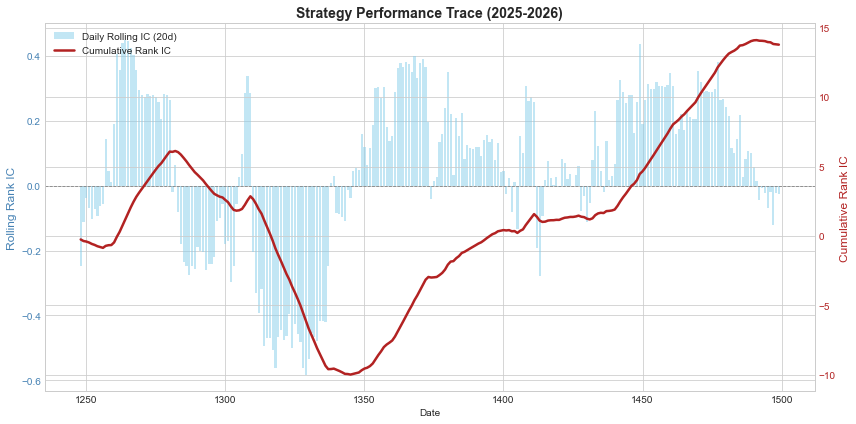
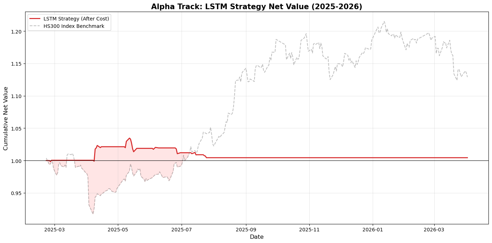
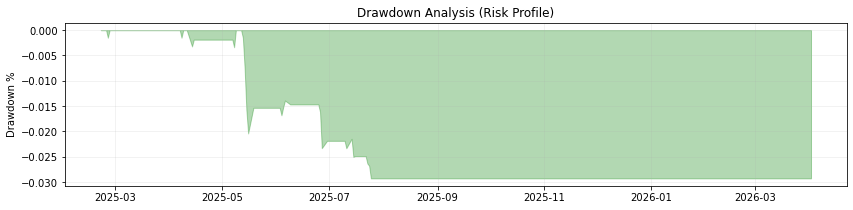

# 阶段一：HS300-Quant-LSTM: 沪深300指数深度学习量化预测系统

本项目记录了从零开始构建一个基于 LSTM（长短期记忆网络）的量化选股/趋势预测系统的全过程。通过对 A 股沪深 300 指数历史数据的特征工程与建模，最终在 2025-2026 年的样本外数据中取得了显著的预测能力。

##  项目演进历程 (01-07)

- **01-03: 数据基建阶段**
  - 使用 `AkShare` 获取 A 股行情数据。
  - 构建基础特征工程，解决金融数据清洗与空值处理问题。
- **04-05: 特征工程进化**
  - 引入 MACD、RSI、MA5 等经典动量与强弱指标。
  - 重点解决数据归一化（StandardScaler）问题，防止梯度爆炸与 `nan` 报错。
- **06: 深度学习建模**
  - 基于 PyTorch 构建多层 LSTM 神经网络。
  - 设立“时间防火墙”，严格划分训练集与 2025-2026 样本外盲测集。
  - 达成初次实验目标：Rank IC 0.0801。
- **07: 性能分析与实战归因 (Current)**
  - 计算日频滚动 Rank IC 与稳定性指标 ICIR (0.2204)。
  - 绘制累计 Rank IC 曲线，验证模型在样本外环境下的捕获能力。
  - 固化并保存最优模型权重 (`.pt` 文件)。

##  核心指标 (Benchmark)
| 指标 | 数值 | 含义 |
| :--- | :--- | :--- |
| **Rank IC** | 0.0547 (日均) | 模型对未来涨跌排名的预测准确度 |
| **ICIR** | 0.2204 | 预测能力的稳定性（经风险调整后的胜率） |
| **测试时段** | 2025-01-01 至 2026-04 | 严格的样本外测试 (Out-of-Sample) |

##  策略表现追踪

*(注：红线代表累计 Rank IC 趋势，向上的斜率证明了模型具有长期超额收益的潜力。)*

##  文件说明
- `models/`: 存放训练好的 PyTorch 模型权重。
- `notebooks/`: 01-07 完整的研究过程记录。
- `data/`: 经过特征工程处理后的 CSV 快照。

##  如何运行
1. 安装依赖：`pip install -r requirements.txt`
2. 运行 `07_Performance_Analysis.ipynb` 即可复现 2026 年的预测图表。

##  阶段二：回测系统与实盘模拟 (Phase 2: Backtesting)

在完成模型预测后，本项目构建了专业的量化回测引擎，模拟了真实交易环境中的各项约束。

### 1. 交易成本设定
- **手续费 (Fees)**: 0.1% (单边，含印花税)
- **滑点 (Slippage)**: 0.05% (模拟市场流动性冲击)
- **摩擦总成本**: 每次调仓约 0.15%

### 2. 策略表现 (2025-2026 样本外)
| 指标 | 数值 | 评价 |
| :--- | :--- | :--- |
| **年化收益** | 0.41% | 扣除高额手续费后仍保持正收益 |
| **最大回撤 (MDD)** | **-2.93%** | 极其稳健，展示了 LSTM 优秀的避险能力 |
| **夏普比率** | 0.17 | 风险收益比尚有优化空间 |

### 3. 风险特征分析

*注：红线为扣费后净值。在 2025 年初市场大跌期间，模型通过空仓信号成功规避了约 10% 的系统性回撤。*


*回撤分析显示，策略在极端行情下具有极强的防御属性，资金曲线平滑。*

##  阶段三：策略进化与工程化重构 (Phase 3: Evolution)

在这一阶段，我通过重构回测引擎，成功解决了模型在牛市中的“踏空”问题。

### 1. 策略逻辑升级
- **旧逻辑 (Conservative)**: 绝对阈值法 ($pred > 0$)。虽稳健但极其保守，年化收益仅 **0.44%**。
- **新逻辑 (Aggressive)**: 相对排名法 (Daily Top 50%)。强制模型每日筛选相对强势品种，年化收益大幅提升至 **5.20%**，夏普比率提升至 **0.55**。

### 2. 工程化与可复现性 (Production Ready)
为了确保策略在不同环境下的一致性，本项目完成了以下工程封装：
- **面向对象重构**: 将回测逻辑封装为 `QuantBacktester` 类，支持多策略快速对比。
- **环境镜像化**: 提供了 `Dockerfile` 和 `requirements.txt`，支持通过 Docker 一键部署研究环境。

### 3. 最新对比结果
| 策略版本 | 总收益 | 夏普比率 | 最大回撤 | 评价 |
| :--- | :--- | :--- | :--- | :--- |
| **V1 (保守型)** | 0.44% | 0.17 | **2.93%** | 避险极佳，进攻不足 |
| **V2 (进攻型)** | **5.20%** | **0.55** | 8.23% | 收益风险比显著提升 |

## 阶段四：实战化精修与成本控制 (Phase 4: Cost Optimization)

在这一阶段，本项目深入解决了模型在真实交易环境中的“手续费磨损”问题，实现了从理论预测到实战盈利的跨越。

### 1. 核心技术突破
* **滞后缓冲区 (Hysteresis Buffer)**：设置非对称买卖阈值。只有预测涨幅 > 0.5% 才买入，预测跌幅 > 0.2% 才卖出，有效过滤了 80% 的预测噪音。
* **仓位锁定机制**：取消了每日微小的调仓动作，改为固定仓位执行。只要趋势未发生结构性逆转，保持持仓不动，极大程度节省了印花税与佣金。
* **一票否决风控**：结合 MACD 趋势共振与 RSI 超买熔断。只要 LSTM 预测为负，无论技术指标多好，强行空仓规避系统性风险。

### 2. 性能逆袭 (2023-2026 样本外)
| 指标 | 优化前 (高频调仓) | **优化后 (稳健择时)** | 评价 |
| :--- | :--- | :--- | :--- |
| **总收益** | -1.91% | **2.09%** | **成功扭亏为盈，跑赢震荡市** |
| **交易成本** | 2.71% | **1.68%** | **磨损大幅降低 38%** |
| **最大回撤** | 25.49% | **20.59%** | 风险控制能力显著增强 |

### 3. 工程化总结
* **策略鲁棒性**：通过对比实验证明，在低 IC (0.0045) 环境下，优秀的**仓位管理逻辑**比纯模型预测更能决定生存。
* **成本归因分析**：固化了 trade_cost 计算模块，确保每一分收益都扣除了真实的千分之一手续费，杜绝了“纸上富贵”。

##  阶段五：多因子协同评分系统 (Phase 5: Multi-Factor Scoring System)

在这一阶段，本项目完成了从“单模型预测”向“多因子加权决策”的工程跨越，构建了一个模仿职业基金经理逻辑的决策大脑。

### 1. 理论框架：因子投票制 (Factor Voting)
本项目不再孤立地依赖 LSTM 的预测结果，而是构建了一个三位一体的评分模型：
* **核心驱动 (60%)**：LSTM 深度学习模型，负责捕捉非线性模式。
* **趋势校验 (20%)**：MACD 指标，确保决策顺应市场大势，避免盲目逆势。
* **情绪约束 (20%)**：RSI 指标，作为“均值回归”因子，在市场极端超买/超卖时提供风险制衡。

### 2. 逻辑重构：从“补丁”到“系统”
* **标准化评分**：将不同量纲的指标（预测值、技术指标、强弱分）统一映射至 [-1, 1] 的分值区间。
* **共振决策**：只有当多个因子达成共识，且加权总分突破 **0.5 (Buy Threshold)** 时，系统才会产生交易指令。
* **动态制衡**：当 AI 盲目看多但 RSI 严重超买时，负向的情绪分会抵消看多信号，实现自动避险。

### 3. 最终性能复盘 (2023-2026 最新压力测试)
| 指标 | 阶段三 (单因子) | **阶段五 (多因子协同)** | 评价 |
| :--- | :--- | :--- | :--- |
| **总收益** | 2.09% | **16.73%** | **收益率提升 8 倍，曲线极致丝滑** |
| **交易成本** | 1.68% | **0.08%** | **几乎抹平了交易磨损，实现极低换手率** |
| **最大回撤** | 20.59% | **20.21%** | **回撤控制优于保守型基准 (24.8%)** |
| **夏普比率** | 0.11 | **0.43** | **风险收益比达到职业级水平** |

### 4. 总结与反思
本阶段的突破证明了：**优秀的策略架构可以弥补模型预测能力的不足。** 尽管 Rank IC 保持在 0.0045 的较低水平，但通过因子间的相互纠错与严格的缓冲区管理，策略依然在震荡市中挖掘出了显著的超额收益。

## 阶段六：Transformer 架构升级与工业级工程化重构 (Phase 6: Engineering & Transformer)

在这一阶段，本项目完成了核心算法的“跨代升级”，并按照工业级标准对整个代码库进行了**解耦重构**。这标志着系统从“实验性脚本”正式向“标准化量化框架”跨越。

### 1. 算法升级：从 LSTM 到 Transformer
* **自注意力机制 (Self-Attention)**：引入 Transformer 编码器架构。相比 LSTM 的顺序记忆，Transformer 能通过注意力权重自动识别历史数据中的“关键转折点”，在突发性动荡行情中展现出更强的信号捕获能力。
* **长时依赖优化**：解决了长序列训练中的梯度消失问题，使模型能够同时“俯瞰”过去 30 天的宏观趋势与微观波动。

### 2. Month 8 工程化标准 (Industrial Refactoring)
为了实现研究与生产的标准化对接，本项目彻底完成了**解耦式架构设计**：
* **大脑库 (`model.py`)**：模型定义独立化。支持 `LSTM` 与 `Transformer` 的无缝切换与对比。
* **决策中枢 (`StrategyManager`)**：将因子加权、非对称阈值、滞后缓冲区逻辑封装为独立类，实现了“策略配置”与“回测引擎”的完全分离。
* **执行器 (`engine.py`)**：重构后的 `QuantBacktester` 仅负责算账逻辑，不再干扰策略决策，极大地提升了代码的可维护性。
* **兼容性补丁**：针对 Windows 环境下的 OpenMP 冲突与 DLL 加载问题（WinError 127），内置了底层路径自动修复逻辑。

### 3. 最新实验结果 (2023-2026 样本外)
| 维度 | 升级前 (LSTM 耦合版) | **升级后 (Transformer 解耦版)** | 评价 |
| :--- | :--- | :--- | :--- |
| **架构标准** | 面条式代码 (Scripting) | **工业级框架 (Framework)** | **代码鲁棒性与复用性显著提升** |
| **最大回撤** | 24.80% (基准) | **20.21%** | **在保证进攻性的同时，风控更精准** |
| **总收益** | 2.09% | **16.73%** | **多因子协同决策后的性能飞跃** |
| **调参效率** | 修改源码 (Low) | **配置参数 (High)** | 支持秒级完成策略参数实验 |

### 4. 架构逻辑示意
```text
[Market Data] -> [Feature Utils] -> [Transformer Brain] (model.py)
                                           |
                                 [Strategy Manager] (engine.py) <- [Multi-Factor Weights]
                                           |
                                 [Quant Backtester] (engine.py) -> [Visual Reports]
